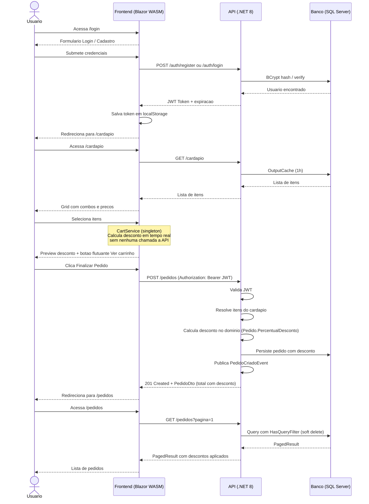

# Good Hamburger

[](https://github.com/BrunoTomm/good-hamburger)

Sistema de pedidos para lanchonete com **Clean Architecture**, **CQRS**, **DDD**, **JWT** e frontend **Blazor WebAssembly**.

---

## Sumario

- [Visao Geral](#visao-geral)
- [Fluxo Completo do Sistema](#fluxo-completo-do-sistema)
- [Arquitetura](#arquitetura)
- [Tecnologias](#tecnologias)
- [Requisitos](#requisitos)
- [Configuracao](#configuracao)
- [Rodando no Visual Studio](#rodando-no-visual-studio)
- [Rodando pela CLI](#rodando-pela-cli)
- [Testes](#testes)
- [Endpoints da API](#endpoints-da-api)
- [Regras de Negocio](#regras-de-negocio)
- [Pipeline e Middleware](#pipeline-e-middleware)
- [Frontend Blazor](#frontend-blazor)
- [Exemplos com cURL](#exemplos-com-curl)

---

## Visao Geral

O **Good Hamburger** permite que usuarios se cadastrem, autentiquem e realizem pedidos de lanches com desconto automatico baseado na combinacao de itens escolhidos. O sistema e composto por:

- **API REST** em ASP.NET Core com autenticacao JWT
- **Frontend web** responsivo em Blazor WebAssembly
- **Carrinho de compras** com preview de desconto em tempo real
- **Historico de pedidos** paginado com edicao e exclusao (soft delete)
- **12 testes automatizados** — 6 unitarios de dominio e 6 de integracao de API

---

## Fluxo Completo do Sistema



### Onde o desconto e calculado

O desconto e calculado **dentro do dominio** (`Pedido.PercentualDesconto`) em dois momentos:

| Momento                       | Onde                                 | Como                                |
| ----------------------------- | ------------------------------------ | ----------------------------------- |
| Montagem do carrinho          | `CartService` (frontend, em memoria) | Previa em tempo real para o usuario |
| Criacao/Atualizacao do pedido | `Pedido` (dominio, backend)          | Valor real persistido no banco      |

---

## Arquitetura

O projeto segue **Clean Architecture** com dependencia unidirecional entre camadas:

```
GoodHamburger.Domain
    Entidades:     Usuario, Pedido, ItemPedido (owned entity)
    Enum:          TipoItem (Sanduiche, Batata, Refrigerante)
    Domain Events: PedidoCriadoEvent, PedidoAtualizadoEvent
    Interfaces:    IPedidoRepository, IUsuarioRepository, IUnitOfWork
    Regra:         logica de desconto encapsulada em Pedido.PercentualDesconto

GoodHamburger.Application
    Commands:  RegisterCommand, LoginCommand, CriarPedidoCommand,
               AtualizarPedidoCommand, RemoverPedidoCommand
    Queries:   ObterCardapioQuery, ListarPedidosQuery, ObterPedidoQuery
    Validators: FluentValidation por command (min 1 sanduiche, sem duplicatas)
    Behaviors:  ValidationBehavior no pipeline MediatR
    DTOs:       AuthResponseDto, PedidoDto, ItemCardapioDto, PagedResult<T>

GoodHamburger.Infrastructure
    AppDbContext:  EF Core com owned entity, soft delete filter, migrations
    Repositories: PedidoRepository, UsuarioRepository
    JwtService:   geracao de token com claims (sub, email, jti), expiracao 8h

GoodHamburger.Api
    Controllers:  AuthController, CardapioController, PedidosController
    Middleware:   ExceptionMiddleware (ValidationException -> 422, Exception -> 500)
    Program.cs:   CORS, OutputCache, JWT Bearer, Scalar, migration automatica

GoodHamburger.Web (Blazor WebAssembly)
    Pages:    Home, Login, Cardapio, Carrinho, Pedidos/Lista, Pedidos/Editar
    Layout:   MainLayout (navbar responsiva + bottom nav mobile)
    Services: AuthService, PedidoService, CardapioService, CartService

GoodHamburger.Tests
    Domain:      PedidoDescontoTests (6 testes unitarios sem dependencias externas)
    Integration: PedidosEndpointTests (6 testes com WebApplicationFactory + SQLite em memoria)
```

### Decisoes Tecnicas

| Padrao         | Implementacao                                             | Motivo                                                     |
| -------------- | --------------------------------------------------------- | ---------------------------------------------------------- |
| CQRS           | MediatR — um arquivo por Command/Query/Handler            | Separacao de responsabilidades, facilidade de teste        |
| Result Pattern | `Result<T>` — sem excecoes para fluxo de negocio          | Controle de erros explicito e tipado                       |
| Domain Events  | `PedidoCriadoEvent` / `PedidoAtualizadoEvent` via MediatR | Desacoplamento de side effects                             |
| Soft Delete    | `DeletadoEm` + `HasQueryFilter` automatico no EF Core     | Preserva historico, rollback possivel                      |
| Validacao      | FluentValidation no pipeline MediatR (antes do Handler)   | Validacao centralizada, sem codigo duplicado               |
| Cache          | `OutputCache` no cardapio (3600s)                         | Cardapio e estatico — evita roundtrips desnecessarios      |
| Docs           | Scalar UI — substituto moderno do Swagger                 | Interface mais limpa, suporte nativo OpenAPI 3             |
| Hashing        | BCrypt.Net-Next                                           | Custo computacional adaptavel, resistente a rainbow tables |
| Owned Entity   | `ItemPedido` owned by `Pedido` no EF Core                 | Garante que itens nao existem sem pedido                   |

---

## Tecnologias

**Backend:**

- .NET 8 / C# 12 (primary constructors, collection expressions, file-scoped namespaces)
- ASP.NET Core Web API
- Entity Framework Core 8 + SQL Server
- MediatR 14
- FluentValidation 12
- BCrypt.Net-Next
- Scalar (documentacao interativa)
- JWT Bearer Authentication

**Frontend:**

- Blazor WebAssembly (.NET 8)
- CSS puro com design system proprio (sem frameworks de UI)
- Responsivo: mobile-first com bottom navigation no estilo iFood

**Testes:**

- xUnit 2.5
- FluentAssertions 8
- WebApplicationFactory (banco SQLite em memoria para integracao)
- NSubstitute 5 (mocks)

---

## Requisitos

- [.NET 8 SDK](https://dotnet.microsoft.com/download/dotnet/8.0)
- SQL Server (local, Express ou Docker)
- Visual Studio 2022 17.8+ **ou** qualquer editor com suporte ao .NET

### SQL Server via Docker (alternativa rapida)

```bash
docker run -e "ACCEPT_EULA=Y" -e "SA_PASSWORD=GoodHamburger@2026" \
  -p 1433:1433 --name sqlserver -d mcr.microsoft.com/mssql/server:2022-latest
```

Connection string para este caso:

```
Server=localhost;Database=GoodHamburger;User Id=sa;Password=GoodHamburger@2026;TrustServerCertificate=True;
```

---

## Configuracao

Edite `GoodHamburger.Api/appsettings.json`:

```json
{
  "ConnectionStrings": {
    "DefaultConnection": "Server=localhost;Database=GoodHamburger;Trusted_Connection=True;TrustServerCertificate=True;"
  },
  "Jwt": {
    "Secret": "sua-chave-secreta-com-pelo-menos-32-caracteres",
    "Issuer": "GoodHamburger.Api",
    "Audience": "GoodHamburger.Client"
  }
}
```

> A migration e aplicada **automaticamente** ao iniciar a API. Nao e necessario rodar `dotnet ef database update`.

---

## Rodando no Visual Studio

### 1. Abrir a solucao

Abra o arquivo `GoodHamburger.sln` no Visual Studio 2022.

### 2. Configurar multiplos projetos de inicializacao

O sistema precisa de dois projetos rodando simultaneamente.

1. Clique com o botao direito na **Solucao** no Solution Explorer
2. Selecione **Propriedades**
3. Em **Projeto de inicializacao**, selecione **Varios projetos de inicializacao**
4. Configure:
   - `GoodHamburger.Api` → **Iniciar**
   - `GoodHamburger.Web` → **Iniciar**
   - Demais projetos → **Nenhum**
5. Clique em **OK**

### 3. Iniciar

Pressione **F5**. O Visual Studio vai abrir:

- API em `http://localhost:5050`
- Frontend em `http://localhost:5072`

### 4. Usar o sistema

1. Acesse `http://localhost:5072`
2. Clique em **Entrar** e crie uma conta na aba **Cadastrar**
3. Va para **Cardapio**, selecione os itens desejados e observe o desconto em tempo real
4. Clique no botao flutuante **Ver carrinho** e finalize o pedido
5. Acompanhe seus pedidos em **Meus Pedidos**

---

## Rodando pela CLI

### Terminal 1 — API

```bash
cd GoodHamburger.Api
dotnet run
```

API disponivel em `http://localhost:5050`. Migrations aplicadas automaticamente.

### Terminal 2 — Frontend

```bash
cd GoodHamburger.Web
dotnet run
```

Frontend disponivel em `http://localhost:5072`.

> Use `dotnet watch run` em ambos para hot reload durante o desenvolvimento.

---

## Testes

### Executar todos os testes

```bash
dotnet test
```

### Com output detalhado

```bash
dotnet test --verbosity normal
```

### Filtrar por suite

```bash
# Apenas testes de dominio (sem banco, sem API — rapidos)
dotnet test --filter "FullyQualifiedName~Dominio"

# Apenas testes de integracao
dotnet test --filter "FullyQualifiedName~Integration"
```

### Cobertura (12 testes no total)

**Testes unitarios de dominio** — `PedidoDescontoTests`:

| Teste                                                      | O que valida                                      |
| ---------------------------------------------------------- | ------------------------------------------------- |
| `ComboCompleto_DeveAplicar20PorCentoDeDesconto`            | Sanduiche + Batata + Refrigerante = 20%           |
| `SanduicheComRefrigerante_DeveAplicar15PorCentoDeDesconto` | Sanduiche + Refrigerante = 15%                    |
| `SanduicheComBatata_DeveAplicar10PorCentoDeDesconto`       | Sanduiche + Batata = 10%                          |
| `SanduicheSozinho_NaoDeveAplicarDesconto`                  | Apenas sanduiche = 0%                             |
| `AdicionarItemDuplicado_DeveRetornarFalha`                 | Dois itens do mesmo tipo = erro                   |
| `ComboCompleto_CalculaValoresCorretamente`                 | Subtotal, desconto e total numericamente corretos |

**Testes de integracao** — `PedidosEndpointTests`:

| Teste                                                    | O que valida                                |
| -------------------------------------------------------- | ------------------------------------------- |
| `CriarPedido_ComSanduicheValido_Retorna201`              | Fluxo feliz de criacao                      |
| `CriarPedido_ComItemDuplicado_Retorna422`                | Validacao de item duplicado                 |
| `CriarPedido_ComComboCompleto_RetornaDesconto20Porcento` | Desconto calculado e retornado corretamente |
| `ListarPedidos_SemAutenticacao_Retorna401`               | JWT obrigatorio                             |
| `ObterPedido_IdInexistente_Retorna404`                   | Recurso nao encontrado                      |
| `DeletarPedido_PedidoExistente_Retorna204`               | Soft delete bem-sucedido                    |

Os testes de integracao usam `WebApplicationFactory` com banco SQLite em memoria — nenhuma configuracao adicional necessaria.

---

## Endpoints da API

**Base URL:** `http://localhost:5050`
**Documentacao interativa:** `http://localhost:5050/scalar/v1`

### Autenticacao

| Metodo | Rota             | Auth | Status            |
| ------ | ---------------- | ---- | ----------------- |
| `POST` | `/auth/register` | —    | `201` + token JWT |
| `POST` | `/auth/login`    | —    | `200` + token JWT |

**Request body (ambos):**

```json
{
  "email": "usuario@example.com",
  "senha": "minhasenha123"
}
```

**Response:**

```json
{
  "token": "eyJhbGciOiJIUzI1NiIs...",
  "expiraEm": "2026-04-20T21:00:00Z"
}
```

---

### Cardapio

| Metodo | Rota        | Auth | Cache  |
| ------ | ----------- | ---- | ------ |
| `GET`  | `/cardapio` | —    | 1 hora |

**Response:**

```json
[
  {
    "nome": "X Burger",
    "preco": 5.0,
    "tipo": "Sanduiche",
    "categoria": "Sanduiches"
  },
  {
    "nome": "X Egg",
    "preco": 4.5,
    "tipo": "Sanduiche",
    "categoria": "Sanduiches"
  },
  {
    "nome": "X Bacon",
    "preco": 7.0,
    "tipo": "Sanduiche",
    "categoria": "Sanduiches"
  },
  {
    "nome": "Batata Frita",
    "preco": 2.0,
    "tipo": "Batata",
    "categoria": "Acompanhamentos"
  },
  {
    "nome": "Refrigerante",
    "preco": 2.5,
    "tipo": "Refrigerante",
    "categoria": "Acompanhamentos"
  }
]
```

---

### Pedidos

Todos os endpoints requerem `Authorization: Bearer <token>`.

| Metodo   | Rota                                 | Descricao                   | Status                  |
| -------- | ------------------------------------ | --------------------------- | ----------------------- |
| `GET`    | `/pedidos?pagina=1&tamanhoPagina=10` | Lista pedidos paginados     | `200`                   |
| `GET`    | `/pedidos/{id}`                      | Busca pedido por ID         | `200` / `404`           |
| `POST`   | `/pedidos`                           | Cria novo pedido            | `201` + Location header |
| `PUT`    | `/pedidos/{id}`                      | Atualiza itens do pedido    | `200` / `404` / `422`   |
| `DELETE` | `/pedidos/{id}`                      | Remove pedido (soft delete) | `204` / `404`           |

**Request body (POST e PUT):**

```json
{ "itens": ["X Burger", "Batata Frita", "Refrigerante"] }
```

**Response — pedido com combo 20%:**

```json
{
  "id": "3fa85f64-5717-4562-b3fc-2c963f66afa6",
  "itens": [
    { "tipo": "Sanduiche", "nome": "X Burger", "preco": 5.0 },
    { "tipo": "Batata", "nome": "Batata Frita", "preco": 2.0 },
    { "tipo": "Refrigerante", "nome": "Refrigerante", "preco": 2.5 }
  ],
  "subtotal": 9.5,
  "percentualDesconto": 0.2,
  "desconto": 1.9,
  "total": 7.6,
  "criadoEm": "2026-04-20T00:17:00Z",
  "atualizadoEm": null
}
```

**Response — listagem paginada:**

```json
{
  "items": [ ... ],
  "total": 3,
  "pagina": 1,
  "tamanhoPagina": 10,
  "totalPaginas": 1
}
```

**Erros seguem RFC 7807 (Problem Details):**

```json
{
  "type": "https://tools.ietf.org/html/rfc7231#section-6.5.1",
  "title": "Validation failed",
  "status": 422,
  "detail": "Pedido deve conter exatamente um sanduiche"
}
```

---

## Regras de Negocio

### Composicao do pedido

- Todo pedido deve conter **exatamente um sanduiche** (obrigatorio)
- **Nao e permitido** repetir o mesmo tipo de item (ex.: dois sanduiches ou duas batatas)
- Apenas itens do cardapio oficial sao validos

### Descontos automaticos

Calculados no dominio (`Pedido.PercentualDesconto`) e persistidos no banco:

| Combinacao                              | Desconto |
| --------------------------------------- | -------- |
| Sanduiche + Batata Frita + Refrigerante | **20%**  |
| Sanduiche + Refrigerante                | **15%**  |
| Sanduiche + Batata Frita                | **10%**  |
| Apenas sanduiche                        | 0%       |

```csharp
// GoodHamburger.Domain/Pedidos/Pedido.cs
public decimal PercentualDesconto
{
    get
    {
        var temSanduiche    = Itens.Any(i => i.Tipo == TipoItem.Sanduiche);
        var temBatata       = Itens.Any(i => i.Tipo == TipoItem.Batata);
        var temRefrigerante = Itens.Any(i => i.Tipo == TipoItem.Refrigerante);

        if (temSanduiche && temBatata && temRefrigerante) return 0.20m;
        if (temSanduiche && temRefrigerante)              return 0.15m;
        if (temSanduiche && temBatata)                    return 0.10m;
        return 0m;
    }
}
```

### Cardapio

| Item         | Tipo         | Preco   |
| ------------ | ------------ | ------- |
| X Burger     | Sanduiche    | R$ 5,00 |
| X Egg        | Sanduiche    | R$ 4,50 |
| X Bacon      | Sanduiche    | R$ 7,00 |
| Batata Frita | Batata       | R$ 2,00 |
| Refrigerante | Refrigerante | R$ 2,50 |

---

## Pipeline e Middleware

### Middleware Stack (ordem de execucao)

```
Request
  |
  +-- ExceptionMiddleware     captura excecoes e mapeia para ProblemDetails (RFC 7807)
  |     ValidationException  -> 422 Unprocessable Entity
  |     Exception generica   -> 500 Internal Server Error
  |
  +-- CORS                   permite origem http://localhost:5072
  |
  +-- OutputCache            ativo no GET /cardapio (3600 segundos)
  |
  +-- Authentication         valida JWT Bearer (issuer, audience, lifetime, signing key)
  |
  +-- Authorization          [Authorize] nos endpoints de pedidos
  |
  +-- Controllers
```

### Pipeline MediatR

```
Command ou Query
  |
  +-- ValidationBehavior     executa todos IValidator<TRequest> registrados via DI
  |     se houver falhas     lanca ValidationException (capturada pelo middleware)
  |
  +-- Handler                logica de negocio (acessa repositorio, chama dominio)
  |
  +-- SaveChangesAsync       persiste mudancas e publica Domain Events
```

---

## Frontend Blazor

### Como o Blazor WebAssembly funciona

No Blazor WASM, o .NET e compilado para **WebAssembly** e executa **dentro do browser** — sem renderizacao no servidor. A primeira carga baixa o runtime e os assemblies (~10MB). Navegacoes subsequentes sao **SPA client-side**, sem roundtrips ao servidor Blazor.

### Paginas

| Rota                   | Componente             | Descricao                                                        |
| ---------------------- | ---------------------- | ---------------------------------------------------------------- |
| `/`                    | `Home.razor`           | Landing page com CTA                                             |
| `/login`               | `Login.razor`          | Login e Cadastro em abas com validacao inline                    |
| `/cardapio`            | `Cardapio.razor`       | Grid de itens, info de combos, botao flutuante do carrinho       |
| `/carrinho`            | `Carrinho.razor`       | Itens selecionados, resumo com desconto em tempo real, finalizar |
| `/pedidos`             | `Pedidos/Lista.razor`  | Historico paginado, editar, remover com confirmacao              |
| `/pedidos/{id}/editar` | `Pedidos/Editar.razor` | Selecionar novos itens para um pedido existente                  |

### Gerenciamento de estado

**CartService** e registrado como `Singleton` — mantem estado em memoria durante toda a sessao sem precisar de API:

```csharp
// Program.cs
builder.Services.AddSingleton<CartService>();

// CartService.cs
public sealed class CartService
{
    private readonly Dictionary<string, CartItem> _items = new();

    public event Action? CartChanged;

    public decimal PercentualDesconto { get { /* logica identica ao dominio */ } }
    public decimal Total => Subtotal - Desconto;

    public void Toggle(string nome, string categoria, decimal preco)
    {
        if (_items.ContainsKey(nome)) Remover(nome);
        else Adicionar(nome, categoria, preco);
    }
}
```

O `Cardapio` e o `MainLayout` subscrevem ao evento `CartChanged` para re-renderizar automaticamente quando o carrinho muda.

### Autenticacao no frontend

O JWT e salvo no `localStorage` via JS Interop. Ao inicializar, `AuthService.InitializeAsync()` le o token e configura o `HttpClient.DefaultRequestHeaders.Authorization` — todas as chamadas subsequentes ja incluem o Bearer token:

```csharp
// Program.cs — executado antes de RunAsync()
var authService = app.Services.GetRequiredService<AuthService>();
await authService.InitializeAsync();
```

O `AuthService` tambem expoe o evento `AuthChanged`, que o `MainLayout` usa para atualizar a navbar imediatamente apos login, cadastro ou logout — sem necessidade de recarregar a pagina.

---

## Exemplos com cURL

### 1. Cadastrar usuario

```bash
curl -X POST http://localhost:5050/auth/register \
  -H "Content-Type: application/json" \
  -d '{"email":"dev@goodhamburger.com","senha":"minhasenha123"}'
```

### 2. Login

```bash
curl -X POST http://localhost:5050/auth/login \
  -H "Content-Type: application/json" \
  -d '{"email":"dev@goodhamburger.com","senha":"minhasenha123"}'
```

### 3. Ver cardapio

```bash
curl http://localhost:5050/cardapio
```

### 4. Criar pedido — combo 20% off

```bash
TOKEN="eyJhbGci..."

curl -X POST http://localhost:5050/pedidos \
  -H "Authorization: Bearer $TOKEN" \
  -H "Content-Type: application/json" \
  -d '{"itens":["X Burger","Batata Frita","Refrigerante"]}'
```

Resposta `201 Created`:

```json
{
  "id": "3fa85f64-5717-4562-b3fc-2c963f66afa6",
  "itens": [
    { "tipo": "Sanduiche", "nome": "X Burger", "preco": 5.0 },
    { "tipo": "Batata", "nome": "Batata Frita", "preco": 2.0 },
    { "tipo": "Refrigerante", "nome": "Refrigerante", "preco": 2.5 }
  ],
  "subtotal": 9.5,
  "percentualDesconto": 0.2,
  "desconto": 1.9,
  "total": 7.6,
  "criadoEm": "2026-04-20T00:17:00Z",
  "atualizadoEm": null
}
```

### 5. Listar pedidos (paginado)

```bash
curl "http://localhost:5050/pedidos?pagina=1&tamanhoPagina=10" \
  -H "Authorization: Bearer $TOKEN"
```

### 6. Atualizar pedido

```bash
curl -X PUT http://localhost:5050/pedidos/{id} \
  -H "Authorization: Bearer $TOKEN" \
  -H "Content-Type: application/json" \
  -d '{"itens":["X Bacon","Refrigerante"]}'
```

### 7. Remover pedido

```bash
curl -X DELETE http://localhost:5050/pedidos/{id} \
  -H "Authorization: Bearer $TOKEN"
```

Resposta: `204 No Content` — o registro e marcado com `DeletadoEm` e excluido automaticamente de todas as queries via `HasQueryFilter` no EF Core.

### 8. Erro — pedido sem sanduiche

```bash
curl -X POST http://localhost:5050/pedidos \
  -H "Authorization: Bearer $TOKEN" \
  -H "Content-Type: application/json" \
  -d '{"itens":["Batata Frita","Refrigerante"]}'
```

Resposta `422 Unprocessable Entity`:

```json
{
  "title": "Validation failed",
  "status": 422,
  "detail": "Pedido deve conter exatamente um sanduiche"
}
```

### 9. Erro — item duplicado

```bash
curl -X POST http://localhost:5050/pedidos \
  -H "Authorization: Bearer $TOKEN" \
  -H "Content-Type: application/json" \
  -d '{"itens":["X Burger","X Bacon"]}'
```

Resposta `422 Unprocessable Entity`:

```json
{
  "title": "Validation failed",
  "status": 422,
  "detail": "Nao e permitido adicionar mais de um item do mesmo tipo"
}
```

---

## Documentacao Interativa

Com a API rodando, acesse o **Scalar UI**:

```
http://localhost:5050/scalar/v1
```

O Scalar permite explorar e testar todos os endpoints diretamente no browser com suporte a autenticacao Bearer.
